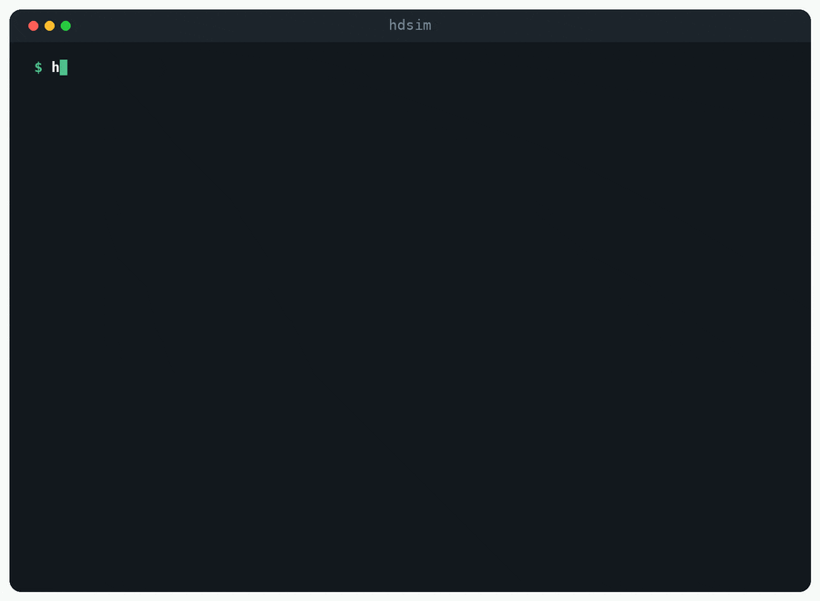
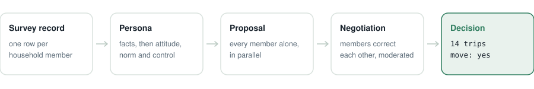

<div align="center">

# 🏠 hdsim

**Household decision simulation through multi-agent negotiation.**

<p>
<a href="https://github.com/HDSim-AI/hdsim"></a>
<a href="https://github.com/HDSim-AI/hdsim/actions/workflows/ci.yml"></a>
<a href="https://github.com/HDSim-AI/hdsim/blob/main/pyproject.toml"></a>
<a href="./LICENSE"></a>
<a href="https://arxiv.org/abs/2604.10475"></a>
<a href="https://yushundong.github.io/pemand_simulation/pemand_official_site.html"></a>
</p>

<!-- Uncomment both once the package is published to PyPI:
<a href="https://pypi.org/project/hdsim/"></a>
<a href="https://pepy.tech/project/hdsim"></a>
-->




</div>

---

## What hdsim does

Predicts what a household decides, from survey records you already have. You get a decision for
each household and the conversation among its members that produced it.

<picture>
  <source media="(prefers-color-scheme: dark)" srcset="./docs/pipeline-core-dark.svg">
  
</picture>

A household decides together. Classical models treat it as one unit with a regression coefficient.
This treats it as several people who hold different information and have to reconcile it.

**Where this helps**

| You are trying to… | What you get |
|---|---|
| Forecast trip generation under a new price, fare, or transit line | Per-household trip counts under that scenario |
| Plan for evacuation or post-disaster relocation | Move or stay, household by household |
| Test a policy you cannot field a new survey for | A counterfactual run on households already in your data |

**Start here**

| You want to… | Go to |
|---|---|
| See it run, with nothing installed | [Live demo](https://yushundong.github.io/pemand_simulation/pemand_official_site.html) |
| Watch a household negotiate, with no API key | [Quick start](#quick-start) |
| Run it against your own model | [Running it live](#running-it-live) |
| Predict household trips | [travel-decision](https://github.com/HDSim-AI/travel-decision) |
| Predict whether a household moves | [residential-mobility](https://github.com/HDSim-AI/residential-mobility) |
| Point it at OpenAI, Ollama, vLLM, or a university proxy | [Configuration](#configuration) |
| Model a decision that is neither | [Adding a domain](#adding-a-domain) |
| See how it scores against classical baselines | [Results](#results) |

## Quick start

No API key and no data download:

```bash
git clone https://github.com/HDSim-AI/hdsim && cd hdsim
pip install -e .
hdsim demo
```

```
Opening positions, proposed independently
  Husband                2 trips
  Wife                   4 trips

Round 1
  Wife: That sounds a little low. Don't forget you'll be driving to work in the morning
        and coming back in the afternoon. That's another two trips, so I think the total
        should actually be 4 trips.
  …
Agreed: 4 trips
```

That is the method in one example. The husband is wrong at the start, the wife knows something he
has forgotten, and the household total moves because she says it.

## Running it live

```bash
cp .env.example .env      # then add a key
hdsim config              # check what each role will use
```

```python
from hdsim.travel import NHTS, Household, build_personas, simulate   # see travel-decision

household = Household.from_json("household.json")

build_personas(household, NHTS)        # facts -> capsule -> roster -> TPB constructs
simulate(household, NHTS)              # independent proposals, then negotiation

print(household.consensus_value)       # 4
print(household.proposal_sum)          # 6, before anyone talked
for turn in household.transcript:
    print(turn["round"], turn["speaker"], turn["text"])
```

## Three details that matter more than they look

**Proposals run in parallel.** Asking members one after another lets later ones anchor on earlier
ones, so the household agrees because of turn order rather than because of anything about the
household.

**Personas are checked, not trusted.** A capsule that drops facts, adds emotional language, or
mentions the quantity being decided is regenerated. Each of those failures shows up later as a
fabricated justification during the discussion.

**Each member is told who the others are, not what they plan.** That asymmetry is what gives the
discussion something to correct.

## Configuration

Any provider that speaks the OpenAI chat API works. Point the base URL at it.

```bash
HDSIM_API_KEY=sk-...
HDSIM_MODEL=gpt-4o-mini
HDSIM_BASE_URL=https://api.openai.com/v1
```

| Endpoint | `HDSIM_BASE_URL` |
|---|---|
| OpenAI | `https://api.openai.com/v1` |
| Ollama | `http://localhost:11434/v1` (key can stay empty) |
| vLLM | `http://localhost:8000/v1` |
| Together | `https://api.together.xyz/v1` |
| OpenRouter | `https://openrouter.ai/api/v1` |

A member proposing a number is a cheap call. The consensus call reasons over the whole household
and is the one worth paying for; `HDSIM_MODERATOR_MODEL` selects the model for it. Anything left
blank falls back to `HDSIM_MODEL`.

```bash
HDSIM_PERSONA_MODEL=
HDSIM_MEMBER_MODEL=
HDSIM_MODERATOR_MODEL=
```

Precedence is argument, then environment variable, then `.env`, then default.

To run weights locally instead: `pip install -e '.[local]'`.

## Adding a domain

A decision domain is data, not code. Supply a `DomainConfig` and the pipeline runs unchanged.

[`examples/minimal_domain.py`](examples/minimal_domain.py) is a complete one, in one file, that
runs with no API key:

```bash
python examples/minimal_domain.py
```

Four things differ between domains: what is being decided, how a survey row reads in English, what
a persona may never say, and how members are introduced to each other. The example marks all four.
[CONTRIBUTING.md](CONTRIBUTING.md) covers the rest — the loader, the prompts, and the baseline a
domain needs before it is a result rather than a demo.

One of the four is worth stating here, because it is the one that quietly ruins an evaluation.
**`banned_patterns` is not optional.** Persona text is written before the household decides, so if
it names the quantity under discussion the agents are no longer deciding anything, and the numbers
come out excellent and meaningless.

## Results

| Dataset | Metric | Best baseline | PEMAND |
|---|---|---|---|
| NHTS 2017 | MAE ↓ | 3.07 (Gradient Boosting) | **2.38** |
| NHTS 2017 | sMAPE ↓ | 50.84 (MLP) | **34.48** |
| Puget Sound 2023 | MAE ↓ | 2.75 (Random Forest) | **1.99** |
| Puget Sound 2023 | ±2 Accuracy ↑ | 0.59 (Random Forest) | **0.78** |
| PSID 2021–2023 | F1 ↑ | 0.55 (Gradient Boosting) | **0.73** |

Table 1, [arXiv:2604.10475v2](https://arxiv.org/abs/2604.10475). The first four rows are trip
generation, the last is the move-or-stay decision.

## Domain packages

**This repository is the core.** It holds the method and knows nothing about any particular
decision. A domain package adds a survey loader and one `DomainConfig`; the pipeline is unchanged.

<p align="center">
<picture>
  <source media="(prefers-color-scheme: dark)" srcset="./docs/architecture-dark.svg">
  
</picture>
</p>

| Package | Repository | Decides |
|---|---|---|
| `hdsim.travel` | [travel-decision](https://github.com/HDSim-AI/travel-decision) | How many trips the household makes tomorrow |
| `hdsim.mobility` | [residential-mobility](https://github.com/HDSim-AI/residential-mobility) | Whether the household moves |

## Layout

`hdsim` is a namespace package. This distribution owns `hdsim.core`; the domain packages own
`hdsim.travel` and `hdsim.mobility`, so all three install alongside each other.

```
hdsim/core/
├── household.py    Household and Member, shared by every stage
├── domain.py       DomainConfig, everything that differs between domains
├── persona.py      facts -> capsule -> constructs, with validation
├── stage1.py       the published persona prompts, labels and parsers
├── negotiate.py    parallel proposals, then moderated discussion
├── stage2.py       the published negotiation prompts, labels and parsers
├── backends.py     model access and role configuration
├── replay.py       offline recordings for the demo
├── evaluate.py     metrics and a paired bootstrap
├── cli.py          hdsim demo, hdsim config
└── fixtures/       bundled recordings the offline demo plays
```

## Contributing

A new decision domain is one file. Copy
[`examples/minimal_domain.py`](examples/minimal_domain.py), change the four marked places, and run
it with no API key:

```bash
python examples/minimal_domain.py
```

[CONTRIBUTING.md](CONTRIBUTING.md) walks through that, and through improving an existing domain or
changing the core.

## Citation

```bibtex
@article{sun2026pemand,
  title   = {PEMAND: Persona-Enriched Multi-Agent Negotiation for Household Decision-Making},
  author  = {Sun, Yuran and Sameen, Mustafa and Zhang, Yaotian and Gu, Rongguan and
             Vibhute, Mrunal and Wu, Chia-yu and Lei, Yuanyuan and Zhao, Xilei},
  journal = {arXiv preprint arXiv:2604.10475},
  year    = {2026}
}
```

MIT licensed.
